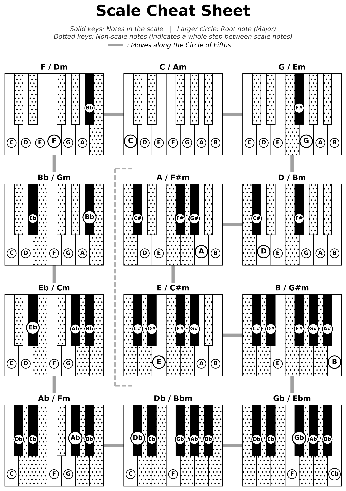

# 🎹 Piano Scale Cheat Sheet Generator



Generate a beautifully visualized Piano Scale Cheat Sheet with Python! The generated PDF is optimized for A4 size and black-and-white printing.

## ✨ Features of the Generated Sheet

* **Visualizes scale notes on the keyboard at a glance**
  * **Emphasized root notes:** The root note of each key is highlighted with a larger circled label.
  * **Easy tracking of sharps and flats:** The display clearly indicates not only the physical positions of sharps (#) and flats (b), but also their total count within the key.
  * **Whole step indication:** Non-scale keys are shaded with a dotted pattern, making it visually explicit when two scale notes are separated by a whole step.
* **Circle of Fifths layout:** Keys with a perfect fifth relationship are placed directly adjacent to one another.

## 🚀 How to Use

1. Install the required library:
   ```bash
   pip install matplotlib
   ```

2. Run the script:
   ```bash
   python scale_cheat_sheet.py
   ```

3. Open the generated `scale_cheat_sheet.pdf`!

## 📄 License

This project is licensed under the [BSD 3-Clause License](LICENSE).
